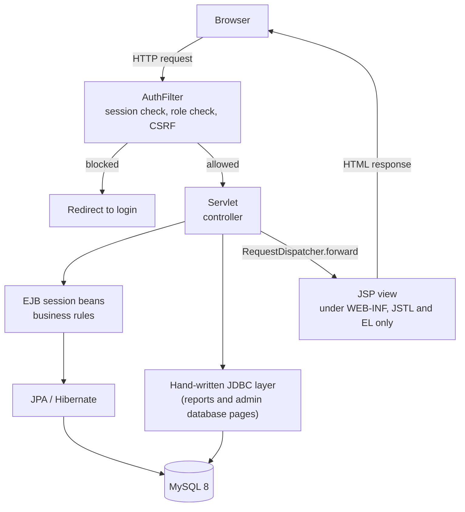
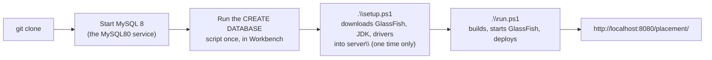
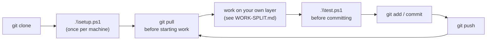

# Campus Placement and Training Cell

A Jakarta EE 10 web application. Students see the drives their record
actually qualifies them for; the placement officer runs the drives and moves
candidates through the pipeline.

Built on Servlets, JSP with JSTL, EJB (stateless, stateful, singleton, a
message driven bean, an interceptor), JNDI, JPA with Hibernate, and a
hand-written JDBC layer over MySQL.

| | |
|---|---|
| **Server** | GlassFish 7.0.23 (private copy under `server\`, nothing installed on the machine) |
| **Language / runtime** | Java 17 source level, run on a private JDK 21 |
| **Database** | MySQL 8, reached through a JNDI connection pool |
| **Persistence** | JPA, Hibernate named explicitly as the provider |
| **Views** | JSP, JSTL and EL only, scriptlets disabled |
| **Tests** | JUnit 5, 99 tests, run standalone with no Maven |

---

## How a request moves through the system



A servlet never talks to `HttpServletResponse` directly with data. It calls an
EJB (or the JDBC layer, for the reports and database pages), puts the result
on the request, and forwards to a JSP. The JSP cannot be opened directly from
a browser because it lives under `WEB-INF`.

---

## Getting started (first time on a machine)



Every step after that is just `.\run.ps1` again, or `.\stop.ps1` to shut the
server down. `setup.ps1` only needs to run once per machine; it is safe to
run again and it skips anything already downloaded.

---

## Running it, step by step

**Prerequisite:** the MySQL 8 service must be running on `localhost:3306`.
Nothing else needs installing on the machine itself; GlassFish 7 and a
private JDK 21 live under `server\` and run in place.

**1. First time after cloning**, fetch GlassFish, the JDK, and the drivers
(all gitignored, not in the repo):

```powershell
.\setup.ps1
```

This downloads about 330 MB and only needs to run once per machine. Safe to
re-run.

**2. First time only, create the database.** In MySQL Workbench, on the
`root` connection:

```sql
CREATE DATABASE IF NOT EXISTS placement_cell
  CHARACTER SET utf8mb4 COLLATE utf8mb4_unicode_ci;
CREATE USER IF NOT EXISTS 'placement_user'@'localhost' IDENTIFIED BY 'Placement@2026';
GRANT ALL PRIVILEGES ON placement_cell.* TO 'placement_user'@'localhost';
FLUSH PRIVILEGES;
```

**3. Then, every time, from this folder in PowerShell:**

```powershell
.\run.ps1        # compiles, starts GlassFish, deploys
.\stop.ps1       # shuts the server down
.\test.ps1       # runs the test suite
.\build.ps1      # compiles and packs the WAR only
```

Open **http://localhost:8080/placement/**

| Role | Email | Password |
|---|---|---|
| Placement officer | `tpo@campus.edu` | `Campus@2026` |
| Student | `aarti.deshpande@campus.edu` | `Campus@2026` |

The database fills itself on first start: 2 officers, 6 students, 4
companies, 5 drives and a spread of applications. Restarting never wipes it,
and the seeder does nothing if accounts already exist.

---

## Demonstrating it in a few minutes

| Show | Where | What it proves |
|---|---|---|
| Wrong email refused | Sign in with `admin@campus` | Validation runs before any query |
| Wrong password | Any real email, wrong password | Same message as an unknown account, and a countdown after three tries |
| Eligibility | Sign in as a student, **Drives** | Every rule checked, reasons shown where it fails |
| Apply | Open a drive, **Apply** | Writes the row and queues a JMS message |
| Officer console | Sign in as `tpo@campus.edu` | Different navigation, different role |
| Batch shortlist | **Shortlist**, pick a drive, tick names | A stateful session bean holding your selection across requests |
| Reports | **Reports** | Live JDBC connection metadata, aggregate SQL, the SQL itself printed |
| SQL injection | **Reports**, filter with `' OR 1=1 --` | Treated as a literal branch name |
| Transaction | **Reports**, close a drive | Two statements committed together, or neither |
| The schema itself | **Database → Structure** | Columns, keys and indexes read from `DatabaseMetaData`, and the foreign keys the JPA mapping produced |
| The rows | **Database → Rows** | Any table, paged, with password digests masked |
| Live SQL | **Database → Query console** | Type a `SELECT` and see the `ResultSet` render |
| The console refusing to be abused | Console, try `DROP TABLE student_profile` | Refused, with the reason, three layers deep |
| Non blocking upload | **Import** | Reads the request with a `ReadListener` |
| Audit trail | **Audit** | Every row written by the interceptor, passwords redacted |
| Role guard | As a student, open `/placement/admin/students` | 403 page, not a redirect |

---

## Layout

```
src/main/java/com/campus/placement/
  entity/    JPA entities
  ejb/       session beans, the MDB, the interceptor, the eligibility rules
  jdbc/      the JDBC reporting layer
  security/  password hashing and the authentication filter
  util/      validation, branches, upload storage
  web/       servlets, session model, listeners
src/main/webapp/
  WEB-INF/views/          JSP pages, unreachable from a browser
  WEB-INF/web.xml         session, error pages, scriptlets disabled
  WEB-INF/glassfish-resources.xml   the connection pool and datasource
  assets/                 stylesheets
src/test/java/            JUnit 5 tests
server/                   GlassFish, JDK 21, MySQL driver, JUnit (gitignored, see setup.ps1)
docs/                     WORK-SPLIT.md, SECURITY.md, TEAM-BRIEF.html
deploy/                   Dockerfile, docker-compose.yml, HOSTING.md (parked, not in use)
```

Who wrote what is in **[docs/WORK-SPLIT.md](docs/WORK-SPLIT.md)**. The
security and code quality review, including the risks that were deliberately
accepted, is in **[docs/SECURITY.md](docs/SECURITY.md)**.

---

## Working as a team



- Everyone owns a whole layer end to end (see
  **[docs/WORK-SPLIT.md](docs/WORK-SPLIT.md)**), so two people are rarely
  editing the same file at the same time.
- Pull before you start a session, run `.\test.ps1` before you commit, push
  when it is green.
- If two people do touch the same file, resolve the conflict by hand rather
  than force-pushing over someone else's work.

---

## Notes worth knowing

- The MySQL driver is copied into `domain1\lib` by `run.ps1`, not bundled in
  the WAR, because the pool is created before the application loads.
- On some shells the detached `asadmin start-domain` fails and `run.ps1`
  falls back to a hidden foreground process. The warning is expected, not a
  failure.
- Resumes are written outside the deployment so a redeploy cannot wipe them.
